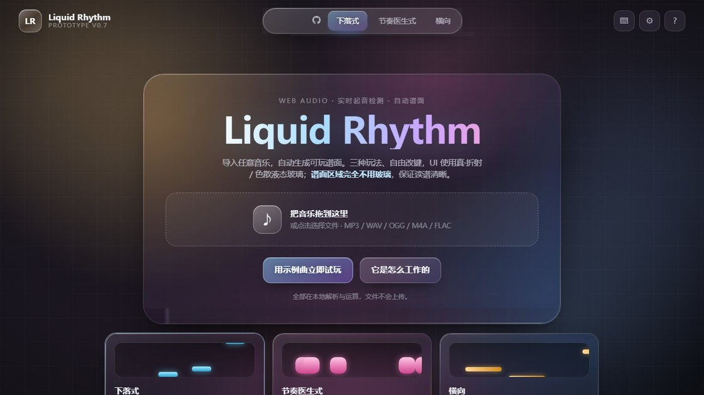
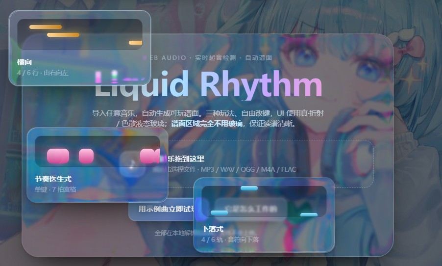
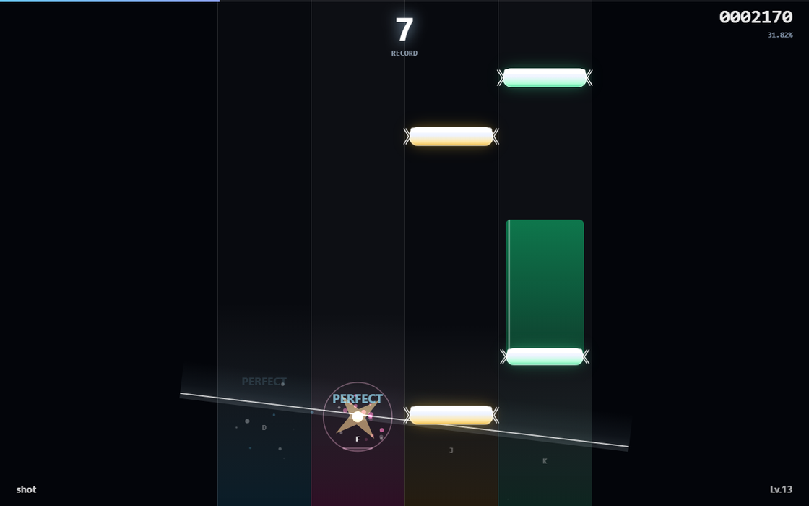
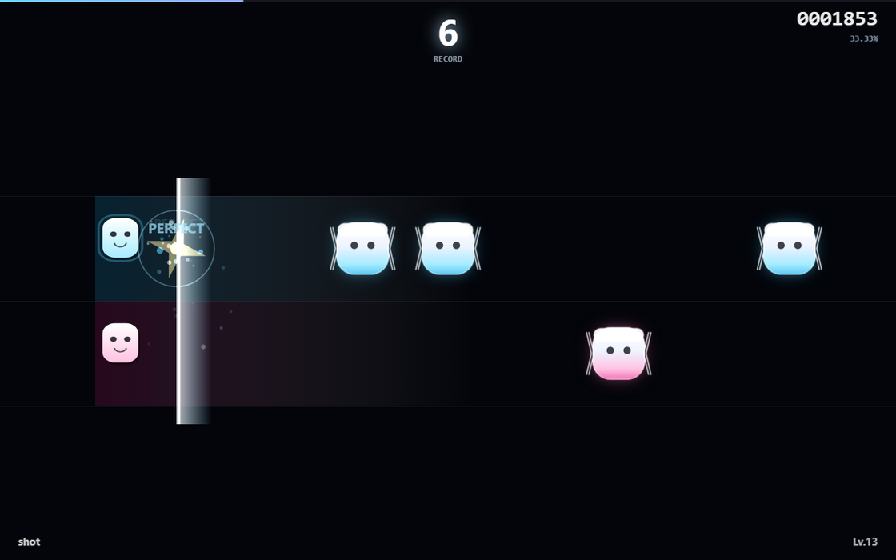
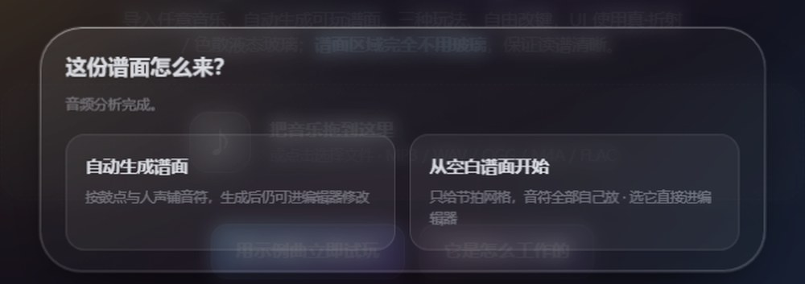
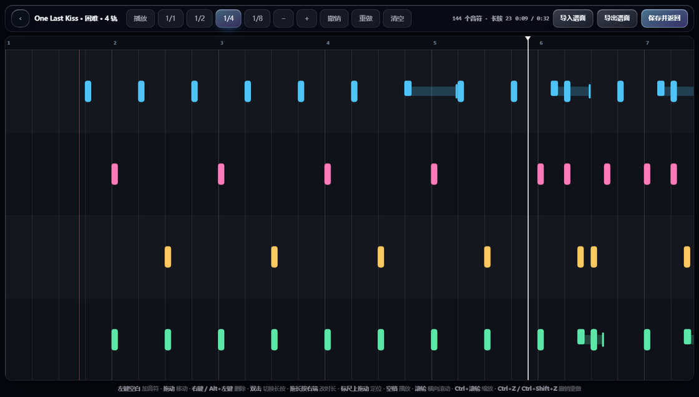

<div align="center">

# Liquid Rhythm

**把任意音乐拖进来，现场生成谱面，立刻开打。**

纯前端 · 零依赖 · 零构建 · 双击 `index.html` 就能玩
（本网页游戏几乎全部都由deepseek v4.1 flash模型生成，本人仅作建议、部分bug修复以及测试）




</div>

---

## 这是什么

一个跑在浏览器里的音乐游戏。你把自己的 MP3 / WAV / OGG / FLAC 拖进去，
它当场做频谱分析、识别鼓点与人声、生成一份可玩的谱面 —— 然后你就能打。

**全部在本机完成，音乐文件不会上传到任何服务器。** 没有后端、没有构建步骤、
没有任何第三方库，所有代码都是手写的原生 JavaScript。

## 特性

| | |
| --- | --- |
| **自动谱面** | 实时 FFT 分析，区分底鼓 / 军鼓 / 踩镲 / 人声，按段落结构分配音符密度 |
| **谱面编辑器** | 图形化时间轴，可增删 / 拖动 / 改长按，支持撤销重做与**谱面导出导入** |
| **三种玩法** | 下落式（贴近 Phigros）· 节奏医生式（7 拍乐句）· 横向（贴近 Muse Dash） |
| **自动演奏** | 一键演示，走真实判定通道，打出来的是真 PERFECT |
| **真 · 液态玻璃** | SVG `feDisplacementMap` 做边缘折射 + RGB 分通道色散，不是简单的高斯模糊 |
| **自由改键** | 每种玩法、每一档轨道数都能单独配键 |
| **配置备份** | 全部设置和键位可导出成 JSON，换设备直接导入 |
| **可换壁纸** | 内置预设 / 本地图片 / 图片 API（支持 `{w}` `{h}` `{r}` 占位符） |
| **控件全可拖** | 面板位置随手拖，布局自动记住 |

## 以后的计划（画大饼

继续修复遗留的bug
主菜单的界面改进：添加更多功能和自定义选项
选择歌曲后可添加视频文件并在游戏时播放
谱面编辑时支持添加谱面特效（判定条，位移旋转，自定义元素之类的功能）
添加插件功能：支持修改游戏内容，并添加用户的自定义模式、功能
优化自动生成的谱面质量（虽然好像还是不太可能？）
优化视觉效果
将液态玻璃效果继续优化改进，然后单开一个随地嵌入液态玻璃视效的网页插件

## 快速开始

### 方式一：直接打开

下载仓库，双击 `index.html`。

### 方式二：本地服务器（推荐）

个别浏览器对 `file://` 下的音频解码有限制，起个本地服务器最稳：

```bash
# 仓库根目录下执行
python -m http.server 8000
# 然后浏览器打开 http://localhost:8000
```

## 三种玩法

### 下落式 · 贴近 Phigros

4 轨或 6 轨，音符向下落。判定线会**随小节倾斜移动**，音符带箭头端头，
命中时出金色菱形爆点。



### 节奏医生式 · 单键

只有空格一个键。按 **7 拍一句** 制谱，每句从一组节奏型里挑一个，
句内**一定留白** —— 不是每拍都要按。

### 横向 · 贴近 Muse Dash

上/下两条线，方块小怪从右边跑过来，左边是角色，命中会弹一下。



## 键盘操作

| 玩法 | 轨道数 | 默认按键 |
| --- | --- | --- |
| 下落式 | 4 轨 | `D` `F` `J` `K` |
| 下落式 | 6 轨 | `S` `D` `F` `J` `K` `L` |
| 横向 | 2 轨 | `F` `J` |
| 横向 | 4 轨 | `D` `F` `J` `K` |
| 横向 | 6 轨 | `S` `D` `F` `J` `K` `L` |
| 节奏医生式 | 单键 | `Space` |

游戏中按 `Esc` 暂停。所有按键都能在设置里改。

**判定窗口**：PERFECT ±42ms · GREAT ±85ms · GOOD ±125ms · MISS >190ms

## 谱面是怎么生成的

核心思路不是「检到起音就放音符」（那样开头会暴走、全程不停），而是
**先看段落结构，给每个小节定音符预算，再在小节内挑最重要的几个起音**。

1. **段落识别** — 按 4 拍小节统计能量，分 quiet / light / mid / busy 四档，
   每档对应一个每小节音符预算。前两小节能量低就直接不给音符；
   连续 3 小节都在打，第 4 小节强制留白。
2. **乐器分类** — 按 `low/(mid+high)` 频段比值区分底鼓（实测 0.82~1.46）
   与踩镲（0.02~0.05），再用谱平坦度区分有人声的乐音和噪声。
3. **小节内挑选** — 起音按 `强度 × 乐器权重` 排序取前几名。踩镲权重最低
   （16 分踩镲是「全程不停」的主要来源），低难度基本不碰。
4. **音高走向** — 提取主频，人声/旋律的音符跟着音高走楼梯。
5. **轨道分配** — 底鼓踩外轨、军鼓踩内轨、人声走楼梯、踩镲补次外轨，
   再做防连打和强力拍和弦。

详细实现和踩过的坑见 [docs/ENGINEERING.md](docs/ENGINEERING.md)。

## 液态玻璃是怎么做的

不是 `backdrop-filter: blur()` 就完事。真正的玻璃感来自**边缘的折射弯曲**：

- 为每个元素按尺寸生成一张**圆角矩形 SDF 位移图**（Canvas 生成，带缓存）
- 用 SVG `feDisplacementMap` 按这张图做位移，**向内采样**（向外会采到元素外，形成暗边）
- 位移强度在边缘最大、往中心衰减到 0
- **色散只做在边缘**：R / B 通道用一张更窄的位移图配不同的缩放系数，中心不产生彩边
- 结构和强度分离：调强度只改 SVG 属性，不重跑滤镜管线

详细推导、性能数据、以及一堆「为什么玻璃突然失效」的坑
（`backdrop root` 陷阱、`mix-blend-mode`、`will-change`、`filter` 祖先等）
都在 [docs/ENGINEERING.md](docs/ENGINEERING.md)。

## 谱面编辑器

自动生成的谱面不会刚好合你口味。**导入音频并分析完之后会问你一次**，两条路自己选：



- **自动生成谱面** —— 按鼓点与人声铺好音符，之后仍可进编辑器修改
- **从空白谱面开始** —— 只给节拍网格，音符全部自己放，选它**直接进编辑器**，不用先生成再清空

进去之后在横向时间轴上直接改：



| 操作 | 效果 |
| --- | --- |
| 左键点空白 | 在该位置加一个音符（自动吸附网格） |
| Tab | 切换键盘/鼠标添加音符 |
| 拖动音符 | 改时间与轨道 |
| 右键 / `Alt`+左键 | 删除音符 |
| 双击音符 | 在「单击」和「长按」之间切换 |
| 拖长按的右端 | 改长按时长 |
| 标尺上拖动 | 定位播放头 |
| `空格` | 播放 / 暂停 |
| 滚轮 / `Ctrl`+滚轮 | 横向滚动 / 缩放 |
| `Ctrl+Z` / `Ctrl+Shift+Z` | 撤销 / 重做 |
| `Delete` | 删除选中音符 |

工具栏可以切换吸附精度（1/1 ~ 1/8 拍）、缩放、清空。改完点「保存并返回」，
谱面会带回预览页，可以直接开打 —— 保留的谱面在预览页会标出「已手动编辑」。

**导出与导入**：工具栏的「导出谱面」会存成 `.lrchart.json`，「导入谱面」可以读回来。
格式定义见 **[docs/CHART-FORMAT.md](docs/CHART-FORMAT.md)** —— 有完整的字段说明和手写示例，
想写第三方工具或批量生成谱面都可以照着来。导入时会逐条校验，坏数据会被挡住并告诉你第几条出错。

> 注意：改过难度 / 轨道数 / 密度等参数会**重新生成谱面**，手动修改会被覆盖。
> 先导出再调参。

## 手机端

打开时会自动检测设备，判定规则是：

```
① 触屏（pointer: coarse + 有触摸点）且短边 ≤ 600px   → 手机
② UA / Client Hints 说是手机，且短边 ≤ 820px        → 手机
③ 窗口宽度 ≤ 600px（桌面把窗口拖窄也算）             → 手机
否则                                                → 桌面
```

三个约束都是踩过坑才加的：

- **短边要设上限**：iPad / 安卓平板的 `pointer` 同样是 `coarse`、同样有触摸点。
  只看「是不是触屏」会把平板也判成手机 —— 结果 **iPad 竖屏会弹出「请横屏游玩」**，
  而竖屏用平板是完全正常的用法。
- **窄只看宽度**：一开始写的是 `Math.min(w, h) <= 560`，于是「宽而矮」的桌面窗口
  （比如压扁成 1600×500 放在屏幕下方）会被误判成手机。改成只看 `innerWidth`。
- **UA 那层的尺寸上限**：三星 DeX 外接显示器时 UA 仍然说是手机，所以 UA 判据
  也要配一个短边上限（820px），否则会把桌面模式也套上手机布局。
- **UA 用什么匹配**：优先 `navigator.userAgentData.mobile`（Chromium 的布尔值，最准），
  Safari / Firefox 没有这个接口就退回 UA 字符串。Android 这条必须写
  `/Android.*Mobile/` 而不是光看 `Android` —— 手机带 `Mobile` 标记、平板不带，
  正好和「平板不套手机布局」一致。（是 `.*` 不是 `[^)]*`：真实 UA 里
  `SM-S911B)` 的右括号会把后者挡断。）

检测逻辑在 `js/mobile.js`，由 `test/mobile-detect.mjs` 覆盖 29 项断言。

这段检测放在 `index.html` 的 `<head>` 里、`styles.css` **之前**执行 ——
否则手机上会先按桌面布局渲染一两帧再跳成手机布局（首屏闪一下）。
然后在 `<html>` 上加 `.is-mobile`，切换一整套手机布局

**主菜单：缩成居中的一条窄列，一屏看全。**
内容列收窄到 380px 并水平居中，字号与间距整体压紧，模式卡从「上图下文」改成
**左右横排**（预览在左、文字在右，高度从约 110px 压到约 56px）。
实测 390×844 与 360×640 两种尺寸下**都不需要滚动**就能看到全部内容。

**建议全程横屏。** 竖屏时盖一层「请横屏游玩」提示（带旋转动画），
进游戏时还会尝试 `screen.orientation.lock('landscape')`（多数浏览器要求先进全屏，失败就算了）。
提示上留了「仍要竖屏查看」，不想被挡可以点掉，转回横屏后再竖屏会重新提示。

**游戏内：顶部不留任何东西，只保留 Phigros 那样一点点 HUD。**
- **整个顶栏在游戏中隐藏**（桌面端只是淡到 22%，但手机上它占近 1/4 高度，
  而且玻璃按钮会把壁纸糊成一条条斜向色带，看着就是「上面还有 UI 挡着」）。
  隐藏后 `.stage` 自动撑满，画布拿到完整高度。
- 曲名与按键提示的玻璃胶囊也隐藏 —— 它们占地最大、信息价值最低
- 暂停键缩到 **26×26、40% 透明**，贴左上角（用 `::after` 把可点区域撑到 48px，
  所以看着小但不难点）
- 画布上的分数 / 连击 / 曲名 / 等级整体乘 **0.62** 缩放，并避让安全区

**全面屏适配。** 左右上下都按 `env(safe-area-inset-*)` 留出空间，
刘海、圆角、home 条都不会压到内容；画布 HUD 也从 CSS 变量里读同一组安全区数值
（`env()` 在 canvas 里用不了）。

**禁用窗口拖拽。** 手指拖窗口在手机上没有意义，还会抢走触摸滑动 ——
所以手机端**根本不挂载**拖拽（不只是不响应，连 `pointerdown` 监听都不装），
设置里那一行也会隐藏。

**关于滚动。** `.screen` 原本用 flex 的 `margin:auto` 居中，而 `margin:auto`
配合 `overflow:auto` 会让超出部分的内容**划不到**。现在改成
`justify-content: safe center` —— 放得下就垂直居中（"缩到画面中间"），
放不下自动退回顶部开始，不会切掉上面的内容。

旋转屏幕或改变窗口尺寸会重新判定，从手机变回桌面时拖拽会自动恢复。
调试时可以用 `?mobile=1` 强制手机布局、`?mobile=0` 强制桌面布局。

> **测量陷阱**：无头 Chrome 在 Windows 上有 **500px 的最小窗口宽度**，
> 所以 `--window-size=390` 拿到的是「500px 布局裁到 390」，看起来像横向溢出，
> 其实不是。想量真实的 390 / 360 得用固定宽度的 iframe —— 见 `test/mobile-shot.html`。
## 自定义

顶栏模式菜单左边的 GitHub 图标指向本仓库，地址写在 `index.html` 里，搜 `ghLink` 就能找到：

```html
<a class="modes__gh" id="ghLink" href="https://github.com/luobo156/liquid-rhythm" ...>
```

fork 之后换成自己的仓库地址即可。

## 项目结构


```
liquid-rhythm/
├── index.html            页面结构
├── styles.css            全部样式（含液态玻璃系统）
├── js/
│   ├── mobile.js        手机端检测（必须在 styles.css 之前加载）
│   ├── core.js           FFT 分析 / BPM 检测 / 谱面生成（约 915 行）
│   ├── game.js           游戏状态机、渲染、判定（约 1080 行）
│   ├── ui.js             界面、设置持久化、键位（约 1015 行）
│   ├── glass.js          液态玻璃内核（SDF 位移图 + SVG 滤镜）
│   ├── backdrop.js       壁纸预设 / 导入 / 图片 API
│   ├── drag.js           控件拖动
│   ├── editor.js         谱面图形编辑器（时间轴、增删改、导入导出）
│   └── sfx.js            打击音效（Web Audio 合成，无音频文件）
├── test/                 自检脚本（见下）
└── docs/
    ├── ENGINEERING.md    工程笔记：实现细节与踩坑记录
    ├── CHART-FORMAT.md   谱面 JSON 文件格式说明
    └── images/           README 用图
```

无任何第三方依赖（可以自己搜一遍，没有任何 CDN 引用）。

## 开发与自检

仓库里带了一套可复跑的自检脚本：

```bash
node test/verify-structure.mjs   # 结构交叉校验（类名、语法配对）
node test/dsp-test.mjs           # DSP 分析与谱面生成
```

以下用浏览器打开，结果会打印在页面的 `<pre>` 里（也支持 headless Chrome 抓取）：

- `test/e2e.html` — 玩法端到端（判定、长按、连击、自动演奏等 42 项）
- `test/editor-test.html` — 谱面编辑器（增删改、撤销重做、导入校验、渲染等 40 项）
- `test/drag-test.html` — 拖动行为（19 项）
- `test/bench.html` — 液态玻璃性能基准

`test/shot-play.html?mode=fall` 可以把玩法画面定格在任意时刻，方便截图或调参。

## 已知限制

诚实地列一下：

- **谱面质量取决于音乐本身。** 鼓点清晰的流行 / 电子 / 摇滚效果最好；
  自由节奏的古典、爵士，或者编曲很密的曲子，生成结果会比较勉强。
- **假设全曲速度恒定。** 变 BPM 的曲子（渐快、自由速度）会对不上拍。
- **手机上 4 / 6 轨的轨道偏窄。** UI 已经压到一屏看全、游戏内顶部也清空了，但下落式
  在手机上手指仍容易按错轨；横向和节奏医生式（单键）在手机上明显更合适。
- **手机端强依赖横屏。** 竖屏会被提示遮罩挡住（可以点掉，但布局是按横屏设计的）。
- **编辑器的横向平移在手机上靠拖标尺。** 触摸没有滚轮，拖动顶部标尺会让播放头
  带着视图移动；缩放有工具栏的 ± 按钮。
- **液态玻璃吃性能。** 中低端设备建议在设置里把画质调低 ——
  拖动 UI 时会自动切到轻量滤镜（保留折射、去掉色散）。
- **编辑器不会自动备份。** 改完记得「导出谱面」存一份；调难度/密度会重新生成并覆盖手动修改。
- **需要较新的浏览器。** 依赖 `backdrop-filter` 和 SVG 滤镜，
  Chrome / Edge / Safari 的新版本都可以，老浏览器会退化成半透明色块。

## 许可证

[MIT](LICENSE) © 2026 luobo156

音乐版权归各自权利人所有。本项目不附带任何音乐文件，
内置的「示例曲」是代码现场合成的（正弦波 + 噪声），不含第三方素材。
